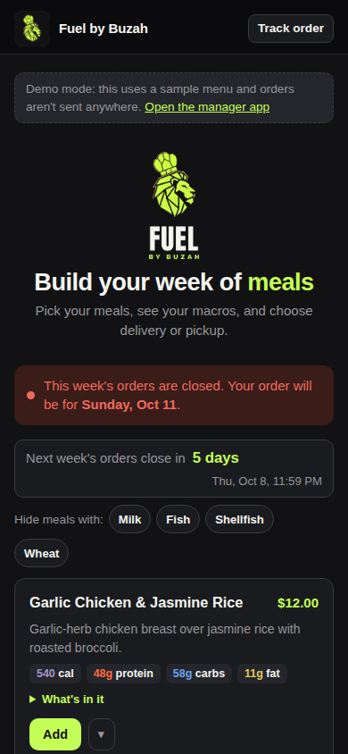
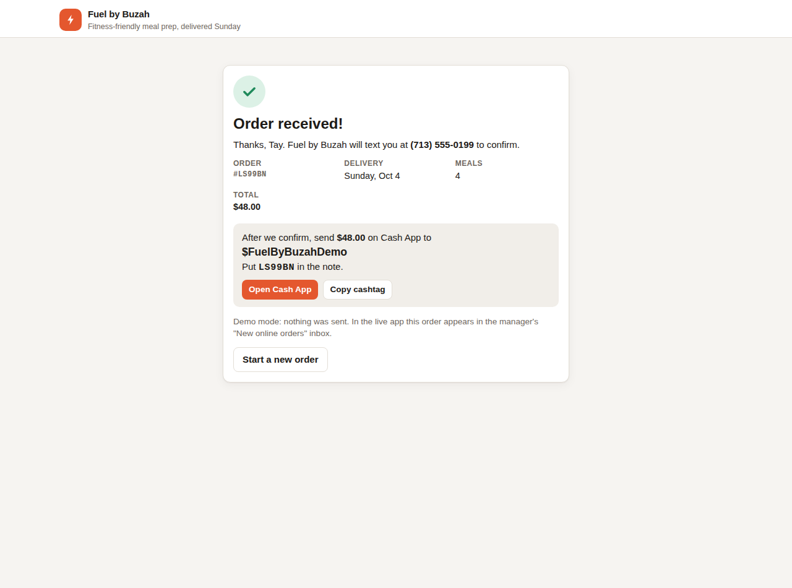
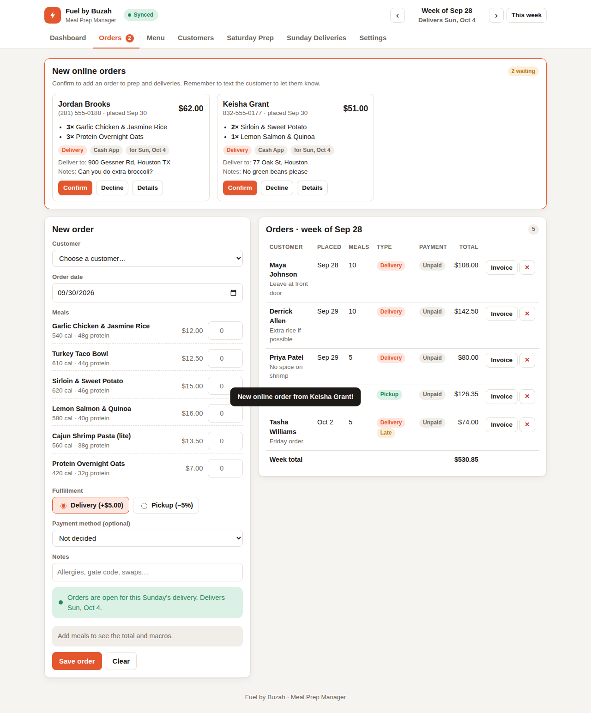
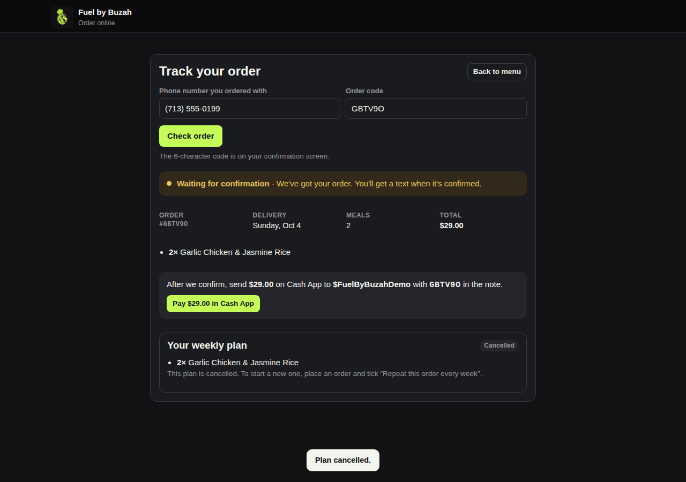
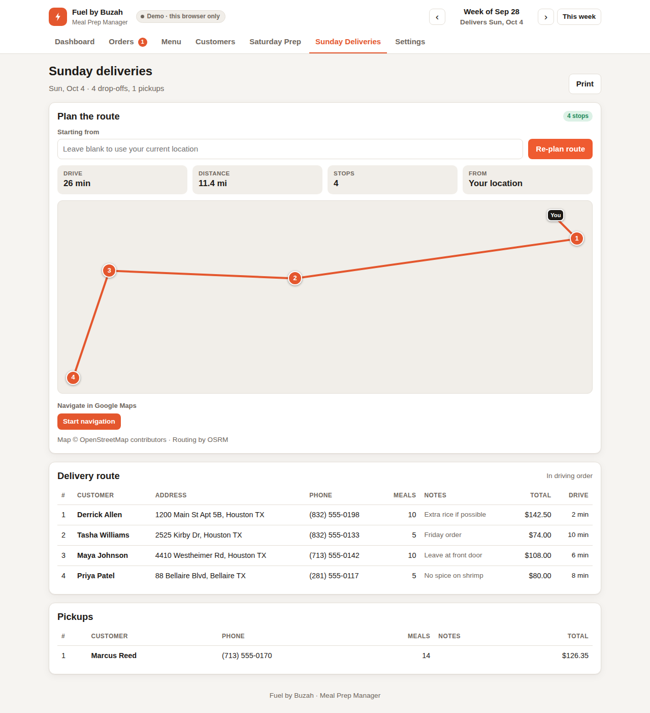
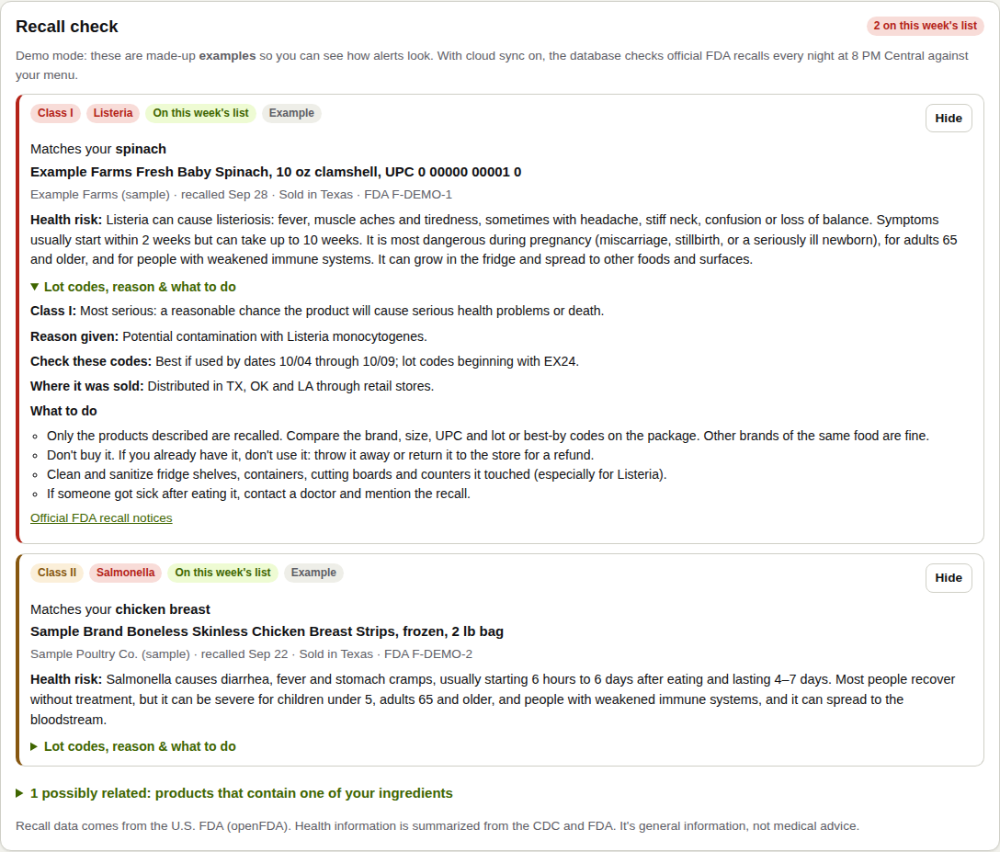
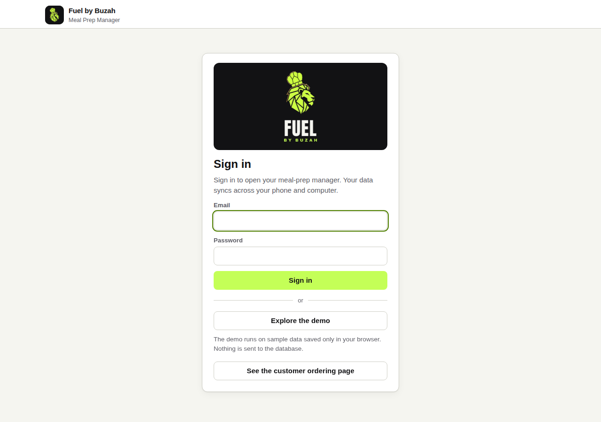

<p align="center"></p>

# Fuel by Buzah — Meal Prep Manager

A web app for running a small weekly meal-prep business. It has two sides:

- **The manager** (`index.html`) is for the owner: orders, macros, Saturday's shopping list, Sunday's deliveries and invoices.
- **The ordering page** (`order.html`) is for customers: they build their week of meals, see their macros and place an order, which lands in the manager for the owner to confirm.

Built with **vanilla HTML, CSS and JavaScript** on the front end and **Supabase** (Postgres, Auth, Realtime) for cloud sync. There is no framework and no build step. It deploys free on GitHub Pages.


## Why I built it

I'm starting **Fuel by Buzah**, a meal-prep service for busy people who want fitness-friendly food instead of fast food. The business runs on a weekly cycle:

| Day | What happens |
|---|---|
| Mon – Thu | Orders are open |
| Friday | Late orders: either accepted with a premium fee or pushed to next week (configurable) |
| Saturday | Shop and prep |
| Sunday | Cook and deliver or hand off pickups |

Spreadsheets got messy fast, so I built a tool that follows this cycle directly.

## Features

- **Weekly order management.** Every order is assigned to the correct delivery week based on the day it was placed. Friday late fees are applied automatically. A calendar dropdown shows every week with its order count and new online orders, so you can jump straight to any week.
- **Live pricing.** The app handles the delivery fee, a percent discount for pickup, optional sales tax (applied to food only) and late fees.
- **Invoices.** Each order produces a clean invoice that you can print or save as a PDF.
- **Macros built in.** Every meal stores calories, protein, carbs and fat. Each customer card shows how much of their daily targets the week's meals cover.
- **Saturday prep.** Shows a cook list (how many of each meal to make) and a shopping list. The shopping list combines ingredients across all orders, e.g. *jasmine rice: 20 cup, used in 2 meals*. You can check items off as you shop.
- **Nightly food recall check.** Every night at 8 PM Central the database checks official FDA food recalls against the ingredients on your menu. Friday night (before Saturday shopping) you get a push summary for the week's shopping list. Each match explains the health risk in plain language, flags the item on the shopping list, and shows the lot codes to compare in the store.
- **Sunday deliveries with route optimization.** One tap plans the fastest driving order from your current location. It shows a map with numbered stops, total miles and drive time, and a drive-time column, then hands the route to Google Maps for turn-by-turn directions. The pickup list is separate, and customers with no address on file are flagged.
- **Menu management.** Ingredients are typed in plain text (`0.4 lb chicken breast`). Removing a meal from the menu keeps it on file, so past invoices stay accurate.
- **Cloud sync with a login.** Data lives in a Supabase Postgres database, protected by Row Level Security. Changes appear live on your phone and laptop through Supabase Realtime.
- **Demo mode.** Visitors click *Explore the demo* to try the full app on sample data stored in their own browser. Nothing touches the real database.
- **First-run migration.** On first sign-in, the app offers to copy data from the browser, load demo data, start blank or import a backup.
- **Backups.** Export and import JSON anytime.
- **On brand.** Uses the Buzah colorway: lime `#C4FF57` on charcoal `#121214`. Every text/background pair meets WCAG AA contrast. On light backgrounds, lime is used only as a fill with dark text, and text accents switch to olive. The customer page is always in the brand's dark look.
- **Responsive, with dark mode.** Works on a phone at the stove or a laptop at the desk.

## Online ordering (v2)

| Customer ordering page | Order confirmation | New orders inbox (manager) |
|---|---|---|
|  |  |  |

| Track my order + weekly plan |
|---|
|  |

- **Shareable link.** Each shop gets `order.html?shop=<name>`, with an open/closed switch in Settings.
- **Easy quantities.** Customers tap + / −, type a number, or pick one from a quick menu (1–30).
- **Customers see macros as they shop.** Totals and per-day averages are shown, and customers can enter daily goals to compare against. Those goals fill in their macro targets in the manager.
- **Owner approval.** Online orders arrive as *pending*, with a live alert, a tab badge and a count in the browser tab. The owner confirms or declines each one, and only confirmed orders count toward prep, deliveries and revenue.
- **Payments outside the app.** Customers pick Cash App, Zelle or cash. For Cash App, the confirmation screen has a *Pay $42.50 in Cash App* button that opens Cash App with the amount already filled in. For Zelle, there are one-tap copy buttons for the contact, the amount and the order code. The manager has a Paid toggle on every order.
- **Deadline countdown.** A live timer shows how long until orders close (Thursday 11:59 PM Houston time), turns gold in the last 24 hours, and switches to the late-order window on its own when the deadline passes.
- **Returning customers in one tap.** The page remembers the customer's details, delivery choice, payment method and macro goals on their own device, then offers *Same as last time* to refill last week's meals. Meals no longer on the menu are skipped, and the customer is told which ones. *Not you?* erases everything saved.
- **Add to calendar.** After ordering, customers can save the delivery or pickup day as an `.ics` file or to Google Calendar.
- **Installable app.** Both pages can be added to a phone's home screen with the lion icon (web app manifest + service worker). The ordering app reopens the customer's shop, and the pages still open offline. Chrome shows an *Install* button, and iPhone users get Add to Home Screen instructions.
- **Returning customers are matched by phone number**, whatever the formatting. A public form can never overwrite a customer's saved details; it only fills in blanks.
- **Phone alerts.** Every new online order pushes a notification to the owner's phone through the free [ntfy](https://ntfy.sh) app, e.g. *"New order: Keisha · 3 meals · $51.00 · delivery Sun, Oct 4"*. Tapping it opens the manager's Orders tab.
- **Meal photos, descriptions and allergens.** Photos are shrunk in the browser and uploaded to a public Supabase Storage bucket, and each owner can only write to their own folder. Customers see a *Contains:* line for the 9 major allergens, a *What's in it* list (ingredient names, not amounts), and can hide meals with allergens they avoid. The page remembers that choice.
- **Weekly limits ("Only 3 left", "Sold out").** Set a max per week on any meal. The ordering page shows what's left, and the database enforces it with row locks, so two customers can't both buy the last one. Declined orders free their meals back up.
- **Track my order.** Customers enter their phone number plus the 6-character order code to see whether the order is waiting, confirmed or paid, with a Cash App button if it's unpaid. The code alone isn't enough, and tracking never shows names or addresses.
- **Weekly meal plans.** At checkout a customer can tick *Repeat this order every week*. Every Monday at 6 AM Central (`pg_cron`), that week's order is created as **pending** for the owner to approve. Meals that are off the menu or sold out are left out, and the owner gets one push summary. Customers can skip a week, pause or cancel from the tracking page, and the owner is alerted. The owner can pause or cancel any plan from the Customers tab.
- **Delivery-area check.** Set your kitchen address and a radius in Settings. New delivery orders show their distance and are flagged *Outside area* in the inbox, so you decide. The kitchen address is only stored in your account and is never sent to customers.
- **Try it:** open `order.html?demo` for a demo that sends nothing.

### How phone alerts work (`supabase/v3_order_alerts.sql`)

An `AFTER INSERT` trigger on `orders` fires only for new **pending online** orders. It queues an HTTPS request with **pg_net**, Postgres's async HTTP client, to ntfy.sh, and ntfy pushes the notification to the phone.

- **Never blocks an order.** The request is sent in the background after the order commits, and any error inside the trigger is swallowed.
- **Minimal data.** The alert holds only the first name, meal count, total and delivery day. There is no address, phone number or last name.
- **Unguessable topic.** The ntfy topic is a random 24-character string generated in the browser with `crypto.getRandomValues`. It is stored in the owner's settings, which RLS protects, and is never returned by `get_shop()`.
- **Test button.** "Send test alert" calls an owner-only function, `send_test_alert()`, which uses the caller's own settings.
- **Safe tap link.** The tap-through link must be `https://` or it's dropped.

Why not SMS? US carriers shut down the free email-to-text gateways, and texting through a provider like Twilio now requires A2P 10DLC business registration. Push notifications are free and instant with no registration. SMS could be added later behind the same trigger.

### How the ordering page stays secure

Customers never get table access. The public page can call exactly two Postgres functions (`supabase/v2_online_ordering.sql`):

| Function | What it does |
|---|---|
| `get_shop(slug)` | Returns the active menu (names, prices, macros, but no ingredients or costs), fees and payment handles |
| `place_order(slug, order)` | Validates everything, **re-prices the order on the server** so a tampered browser can't change the total, applies the order-window rules in the shop's time zone, matches or creates the customer, and inserts a **pending** order |

Validation covers name, phone, address, allowed payment methods, whole quantities from 1 to 50, active meals from this shop only, no duplicate lines, and a maximum of 60 meals. There are also spam guards: at most 3 pending orders per phone and 100 per shop, plus a hidden honeypot field. The order-window rule lives in a private schema (`fuel_private`) that the public API can't reach.

The SQL is covered by 42 ordering tests and 16 alert tests. They include parity checks showing the database computes the **same week and the same total as `js/logic.js`** across 42 day/policy combinations and 40 randomized orders.

## Delivery route optimizer



Planning a route on the **Sunday Deliveries** tab takes four steps:

1. **Geocode.** Each unique delivery address is looked up with OpenStreetMap Nominatim. Every request, retries included, is throttled to one per second, per their usage policy. If an address with an apartment or unit number isn't found, it's retried without the unit. Coordinates are saved on the customer (`customers.geo`), so the next week needs no lookups, on any device. If the address changes, it's looked up again.
2. **Driving-time matrix.** One OSRM `table` request returns real driving times between every pair of stops. It handles one-way streets, since A→B can differ from B→A.
3. **Solve.** `js/route.js` finds the best order for an open route, starting at the driver and ending at the last stop:
   - Up to 15 stops: an **exact** Held–Karp dynamic program (15 stops solve in ~40 ms).
   - Above 15 stops: **multi-start 2-opt + or-opt local search**. On 60 random 12-stop maps it found the true best route every time, checked against the exact solver.
4. **Draw and hand off.** The route line and totals come from OSRM, and the map is drawn with Leaflet on OpenStreetMap tiles. Google Maps links are split into legs to respect its waypoint limits (9 per link on desktop, 3 on mobile).

Fallbacks:

- If the routing server is down, straight-line estimates still produce a good order.
- If an address can't be found, it's flagged and everything else is still routed.
- If the map can't load, the ordered list still works.

## Food recall check (`supabase/v5_recall_checks.sql`)

Before shopping, it helps to know whether anything on the list has been recalled. The database does that check every night:

1. **Download.** At 8 PM Central, `pg_cron` asks [openFDA's food enforcement API](https://open.fda.gov/apis/food/enforcement/) for every recall that is still *Ongoing* and was reported in the last 180 days, about 400 recalls. It also tries the [USDA FSIS recall API](https://www.fsis.usda.gov/recalls) for meat, poultry and eggs. FSIS currently blocks cloud servers, so when it can't be reached the app says so and links to [fsis.usda.gov/recalls](https://www.fsis.usda.gov/recalls) instead of pretending it checked.
2. **Match.** Each recall's product text is compared with every ingredient on your active menu. Matching is word-aware: *berries* matches *blueberries*, but *rice* doesn't match *licorice* and *salmon* doesn't match *Salmonella*. Matches are split into two groups:
   - **Direct:** the recalled product *is* that grocery item, e.g. "Organic Whole Blueberries, 10 oz".
   - **Possibly related:** the product only *contains* it, e.g. "Blackberry Honey Spread" or a salad's ingredient list.
   On real FDA data this cut 82 raw hits down to 13 direct ones. Only direct matches trigger push alerts.
3. **Explain.** Each alert shows the FDA class (I = serious, II = temporary, III = unlikely to cause harm), the hazard (Listeria, Salmonella, E. coli, undeclared allergen, foreign material…) with symptoms, timing and who is most at risk (summarized from the CDC and FDA), whether it was sold in Texas, the lot and best-by codes to compare, and what to do.
4. **Notify.** Friday night sends a summary for this week's shopping list (or "all clear"). Other nights send an alert only when a *new* direct match appears. Notifications use the same ntfy topic as order alerts. **Check now** on the Saturday Prep tab runs the same check on demand.

Security: the alert tables are owner-only under Row Level Security. The app can change only the `dismissed` flag (to hide an alert it has reviewed). The download, matching and push functions live in a private schema that the API can't reach.

## Screenshots

| Orders + live preview | Invoice |
|---|---|
|  |  |

| Saturday prep | Customer macros (dark mode) |
|---|---|
|  |  |

| Recall check (Saturday prep) |
|---|
|  |

## Cloud sync (Supabase)



How it works:

- `supabase/schema.sql` creates four tables: `settings`, `meals`, `customers` and `orders`. Every row has an `owner_id` that defaults to `auth.uid()`.
- **Row Level Security** gives each account access only to its own rows. That's why the publishable key in `js/config.js` can safely be public.
- Primary keys are `(owner_id, id)`, so two accounts can never collide on IDs.
- A composite foreign key stops an order from pointing at a customer that doesn't exist, or at another account's customer.
- Saves are **optimistic**: the UI updates instantly and writes in the background. If a write fails, the app warns you and reloads the true state from the database.
- **Realtime** subscriptions keep devices in sync. An incoming update never wipes a form you're halfway through typing. Every remote event triggers a reload, and the page only re-renders when the data actually changed, so a customer order that lands a split second after the owner saves something is never dropped.

To use your own Supabase project:

1. Run the files in `supabase/` in order (`schema.sql`, `v2_…`, `v3_…`, `v4_…`, `v5_recall_checks.sql`, `v5_recall_schedule.sql`, `v6_customer_features.sql`, `v6_schedule.sql`) in the Supabase SQL Editor. All of them are safe to re-run.
2. Create your login under **Authentication → Users → Add user**, then turn off public sign-ups.
3. Put your project URL and **publishable** key in `js/config.js`. Never use a secret or service-role key there.

To run with no cloud at all, leave both values in `js/config.js` empty. The app then saves everything in the browser.

## Run it

No install is needed. Clone the repo and open `index.html` in a browser.

```bash
git clone https://github.com/<your-username>/fuel-by-buzah.git
cd fuel-by-buzah
open index.html        # macOS  (Windows: start index.html)
```

Open it and click **Explore the demo** to try every screen with sample data, or sign in to use your cloud database.

## Tests

The business rules (order windows, pricing, macros, shopping-list aggregation, validation) live in `js/logic.js`, and the database row mapping lives in `js/store.js`. Both are pure functions with no DOM access, covered by unit tests using Node's built-in test runner, so no dependencies are needed.

```bash
npm test
```

The tests run automatically on every push via GitHub Actions.

## Project structure

```
index.html            Manager app shell
order.html            Customer ordering page
css/styles.css        Styles (CSS variables, light/dark, print styles)
css/order.css         Ordering page styles
js/logic.js           Pure business logic — used by the browser and by Node tests
js/seed.js            Demo data
js/store.js           Storage layer: LocalStore (browser) + CloudStore (Supabase)
js/route.js           Route optimizer: geocoding, OSRM matrix, exact + heuristic solver, Google Maps legs
js/shoptools.js       Ordering page helpers: deadline countdown, Cash App links, calendar files, reorder
sw.js                 Service worker: installable pages, offline fallback (network first)
*.webmanifest         Home-screen app manifests (ordering page + manager)
js/recalls.js         Recall helpers: plain-language health risks, FDA classes, grouping
js/config.js          Supabase URL + publishable key
js/app.js             Manager UI: rendering, events, login, live sync, order inbox
img/                  Logo (full, icon, one-color for print) and app icons
js/order.js           Ordering page: menu, cart, macros, checkout
supabase/schema.sql   Tables, Row Level Security policies, realtime
supabase/v2_online_ordering.sql   Shops, order status/payments, public order functions
supabase/v3_order_alerts.sql      Push alerts for new orders (trigger + pg_net + ntfy)
supabase/v4_route_geo.sql         Saved map coordinates for customers
supabase/v5_recall_checks.sql     Nightly FDA/USDA recall check: download, match, alerts, push
supabase/v5_recall_schedule.sql   pg_cron schedule (8 PM Central nightly)
supabase/v6_customer_features.sql Meal photos/allergens/limits, order tracking, weekly meal plans
supabase/v6_schedule.sql          pg_cron schedule (Mondays 6 AM Central: weekly plan orders)
tests/                Unit tests (node --test)
```

Design choices:

- **Storage sits behind one interface.** The UI calls `persist(op)` with small operations like `upsert`, `remove` and `settings`. `LocalStore` and `CloudStore` both implement it, so the same UI runs offline or synced.
- **Logic is kept separate from UI.** `logic.js` uses a small UMD wrapper, so the same file runs in the browser (as `window.FuelLogic`) and in Node (via `require`). All the rules that matter are tested without a browser.
- **No build step.** The app uses plain `<script>` tags, so it opens straight from the file system and deploys as-is.
- **Money is rounded to cents at every step**, which avoids floating-point errors (`0.1 + 0.2`).
- **Dates are local `YYYY-MM-DD` strings.** This avoids timezone bugs where a Sunday in Houston turns into Monday in UTC.

## Deploy to GitHub Pages

1. Push the repo to GitHub.
2. Go to **Settings → Pages → Build and deployment**, set Source to **Deploy from a branch**, then choose `main` / `(root)`.
3. The app will be live at `https://<your-username>.github.io/fuel-by-buzah/`.

## Roadmap

- SMS alerts via Twilio (once A2P 10DLC registration is approved)
- Automatic "order confirmed" texts to customers (with opt-in)
- Card payments with Stripe Checkout
- Weekly revenue history chart
- Delivery time windows (e.g. "after 2pm") in the route optimizer

## License

MIT
