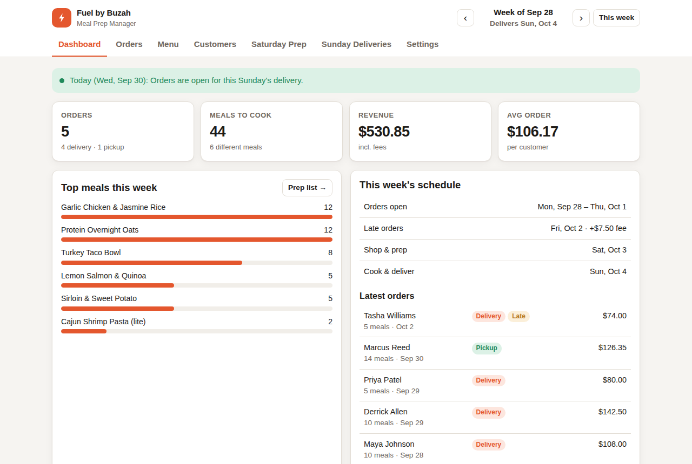
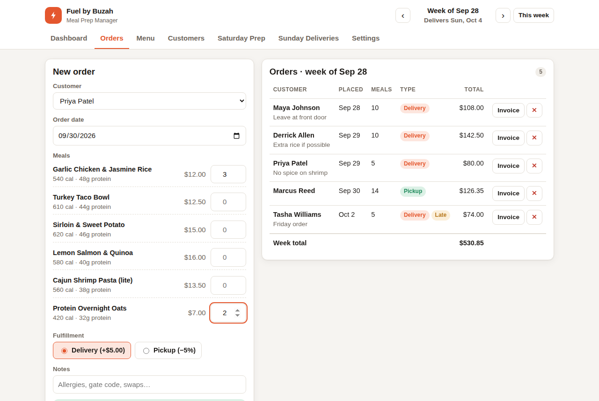
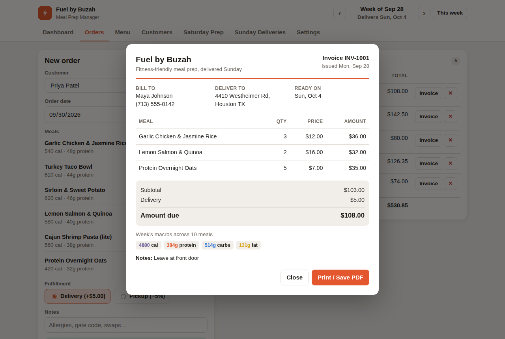
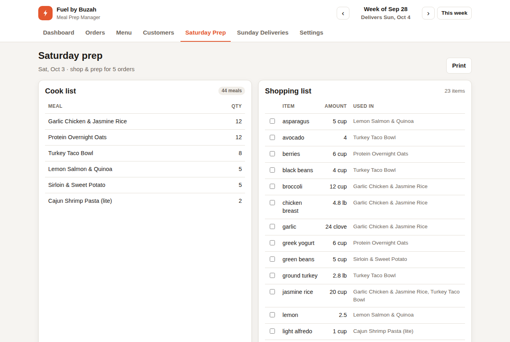
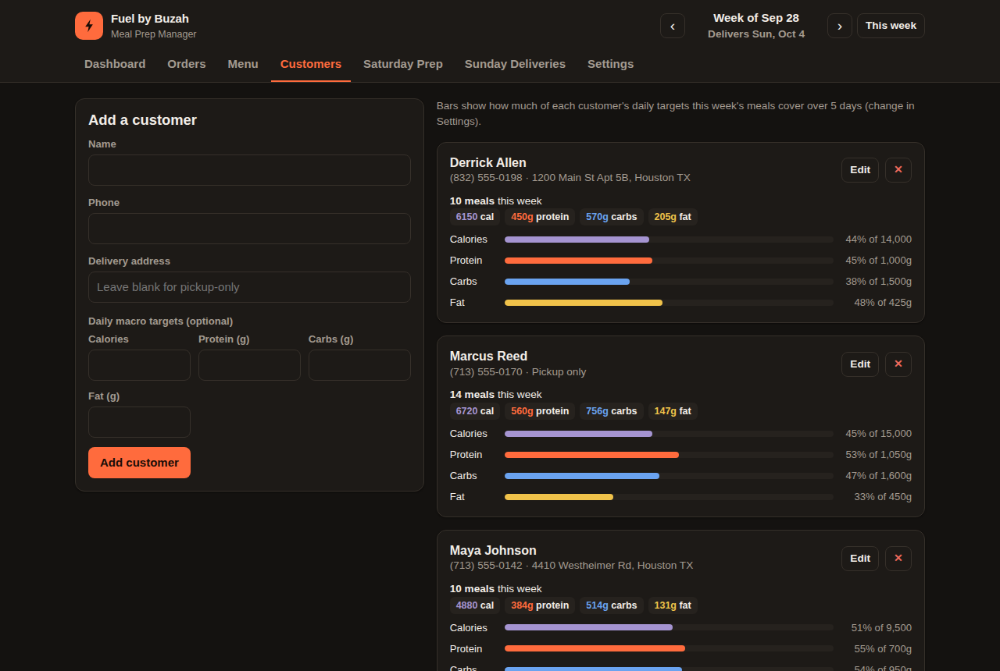

# Fuel by Buzah — Meal Prep Manager

A browser app for running a small weekly meal-prep business. It covers taking orders, tracking each customer's macros, building Saturday's shopping list, planning Sunday's deliveries and printing invoices.

Built with **vanilla HTML, CSS and JavaScript**. There is no framework and no build step. It runs from a single static folder and deploys free on GitHub Pages.



## Why I built it

I'm starting **Fuel by Buzah**, a meal-prep service for busy people who want fitness-friendly food instead of fast food. The business runs on a weekly cycle:

| Day | What happens |
|---|---|
| Mon – Thu | Orders are open |
| Friday | Late orders: either accepted with a premium fee or pushed to next week (configurable) |
| Saturday | Shop and prep |
| Sunday | Cook and deliver or hand off pickups |

Spreadsheets got messy fast, so I built a tool that follows this cycle directly.

## Features

- **Weekly order management.** Every order is assigned to the correct delivery week based on the day it was placed. Friday late fees are applied automatically.
- **Live pricing.** The app handles the delivery fee, a percent discount for pickup, optional sales tax (applied to food only) and late fees.
- **Invoices.** Each order produces a clean invoice that you can print or save as a PDF.
- **Macros built in.** Every meal stores calories, protein, carbs and fat. Each customer card shows how much of their daily targets the week's meals cover.
- **Saturday prep.** Shows a cook list (how many of each meal to make) and a shopping list. The shopping list combines ingredients across all orders, e.g. *jasmine rice: 20 cup, used in 2 meals*. You can check items off as you shop.
- **Sunday deliveries.** A printable delivery route sorted by address, plus a separate pickup list. It flags customers with no address on file.
- **Menu management.** Ingredients are typed in plain text (`0.4 lb chicken breast`). Removing a meal from the menu keeps it on file, so past invoices stay accurate.
- **Your data stays yours.** Everything is stored in `localStorage`, and you can export or import JSON backups.
- **Responsive, with dark mode.** Works on a phone at the stove or a laptop at the desk.

## Screenshots

| Orders + live preview | Invoice |
|---|---|
|  |  |

| Saturday prep | Customer macros (dark mode) |
|---|---|
|  |  |

## Run it

No install is needed. Clone the repo and open `index.html` in a browser.

```bash
git clone https://github.com/<your-username>/fuel-by-buzah.git
cd fuel-by-buzah
open index.html        # macOS  (Windows: start index.html)
```

The app loads with demo data so you can try every screen. To start from scratch, go to **Settings → Start fresh**.

## Tests

The business rules (order windows, pricing, macros, shopping-list aggregation, validation) live in `js/logic.js`. They are pure functions with no DOM access and are covered by unit tests using Node's built-in test runner, so no dependencies are needed.

```bash
npm test
```

The tests run automatically on every push via GitHub Actions.

## Project structure

```
index.html            App shell
css/styles.css        Styles (CSS variables, light/dark, print styles)
js/logic.js           Pure business logic — used by the browser and by Node tests
js/seed.js            Demo data
js/app.js             UI: rendering, events, localStorage
tests/logic.test.js   Unit tests (node --test)
```

Design choices:

- **Logic is kept separate from UI.** `logic.js` uses a small UMD wrapper, so the same file runs in the browser (as `window.FuelLogic`) and in Node (via `require`). All the rules that matter are tested without a browser.
- **No build step.** The app uses plain `<script>` tags, so it opens straight from the file system and deploys as-is.
- **Money is rounded to cents at every step**, which avoids floating-point errors (`0.1 + 0.2`).
- **Dates are local `YYYY-MM-DD` strings.** This avoids timezone bugs where a Sunday in Houston turns into Monday in UTC.

## Deploy to GitHub Pages

1. Push the repo to GitHub.
2. Go to **Settings → Pages → Build and deployment**, set Source to **Deploy from a branch**, then choose `main` / `(root)`.
3. The app will be live at `https://<your-username>.github.io/fuel-by-buzah/`.

## Roadmap

- Customer-facing order form (shareable link)
- Weekly revenue history chart
- Route optimization for deliveries
- Sync across devices (e.g. Supabase or Firebase)

## License

MIT
